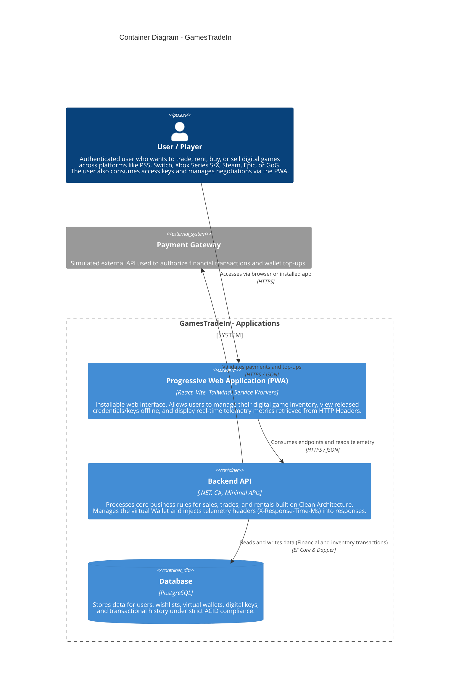

# C4 Model - Level 2: Containers (GamesTradeIn)

This diagram describes the boundaries of the **GamesTradeIn** system, its responsibilities, and how data flows between each component.

```mermaid
C4Container
    title Container Diagram - GamesTradeIn

    Person(user, "User / Player", "Authenticated user who wants to trade, rent, buy, or sell digital games <br/> across platforms like PS5, Switch, Xbox Series S/X, Steam, Epic, or GoG.<br/> The user also consumes access keys and manages negotiations via the PWA.")
    
    System_Ext(gateway, "Payment Gateway", "Simulated external API used to authorize financial transactions and wallet top-ups.")

    System_Boundary(c1, "GamesTradeIn - Applications") {
        Container(web_app, "Progressive Web Application (PWA)", "React, Vite, Tailwind, Service Workers", "Installable web interface. Allows users to manage their digital game inventory, view released <br/> credentials/keys offline, and display real-time telemetry metrics retrieved from HTTP Headers.")
        
        Container(api, "Backend API", ".NET, C#, Minimal APIs", "Processes core business rules for sales, trades, and rentals built on Clean Architecture. <br/> Manages the virtual Wallet and injects telemetry headers (X-Response-Time-Ms) into responses.")
        
        ContainerDb(db, "Database", "PostgreSQL", "Stores data for users, wishlists, virtual wallets, digital keys, <br/> and transactional history under strict ACID compliance.")
    }

    Rel(user, web_app, "Accesses via browser or installed app", "HTTPS")
    Rel(web_app, api, "Consumes endpoints and reads telemetry", "HTTPS / JSON")
    Rel(api, db, "Reads and writes data (Financial and inventory transactions)", "EF Core & Dapper")
    Rel(api, gateway, "Validates payments and top-ups", "HTTPS / JSON")

    UpdateLayoutConfig($c4ShapeInRow="3", $c4BoundaryInRow="1")
```