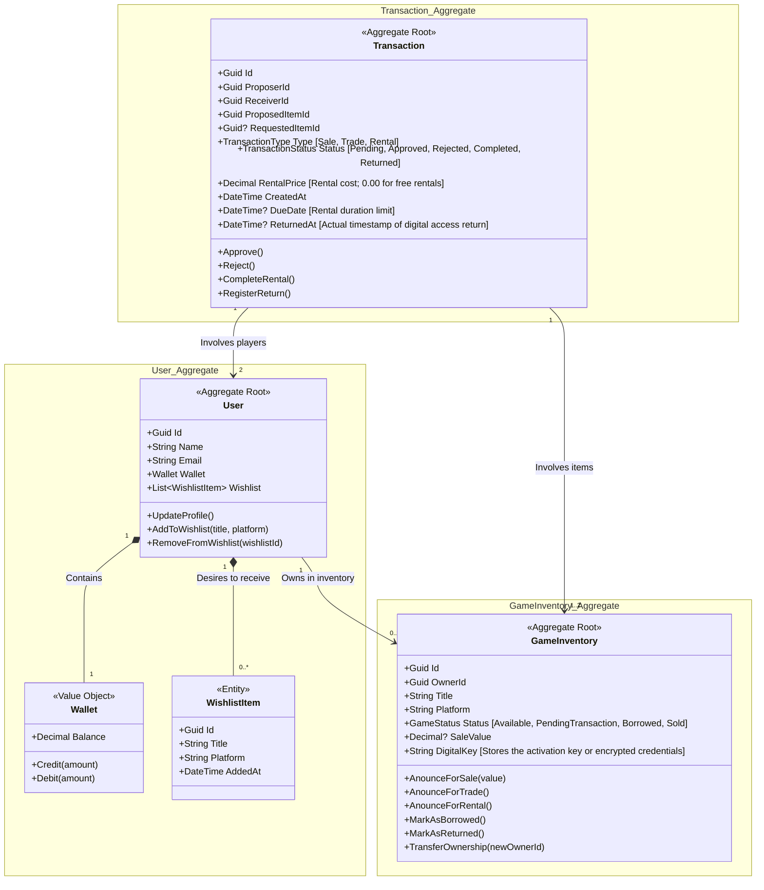

# Domain Model and Aggregates (DDD)

```mermaid
classDiagram
    namespace User_Aggregate {
        class User {
            <<Aggregate Root>>
            +Guid Id
            +String Name
            +String Email
            +Wallet Wallet
            +List~WishlistItem~ Wishlist
            +UpdateProfile()
            +AddToWishlist(title, platform)
            +RemoveFromWishlist(wishlistId)
        }
        class Wallet {
            <<Value Object>>
            +Decimal Balance
            +Credit(amount)
            +Debit(amount)
        }
        class WishlistItem {
            <<Entity>>
            +Guid Id
            +String Title
            +String Platform
            +DateTime AddedAt
        }
    }
    User "1" *-- "1" Wallet : Contains
    User "1" *-- "0..*" WishlistItem : Desires to receive

    namespace GameInventory_Aggregate {
        class GameInventory {
            <<Aggregate Root>>
            +Guid Id
            +Guid OwnerId
            +String Title
            +String Platform
            +GameStatus Status [Available, PendingTransaction, Borrowed, Sold]
            +Decimal? SaleValue
            +String DigitalKey [Stores the activation key or encrypted credentials]
            +AnounceForSale(value)
            +AnounceForTrade()
            +AnounceForRental()
            +MarkAsBorrowed()
            +MarkAsReturned()
            +TransferOwnership(newOwnerId)
        }
    }

    namespace Transaction_Aggregate {
        class Transaction {
            <<Aggregate Root>>
            +Guid Id
            +Guid ProposerId
            +Guid ReceiverId
            +Guid ProposedItemId
            +Guid? RequestedItemId
            +TransactionType Type [Sale, Trade, Rental]
            +TransactionStatus Status [Pending, Approved, Rejected, Completed, Returned]
            +Decimal RentalPrice [Rental cost; 0.00 for free rentals]
            +DateTime CreatedAt
            +DateTime? DueDate [Rental duration limit]
            +DateTime? ReturnedAt [Actual timestamp of digital access return]
            +Approve()
            +Reject()
            +CompleteRental()
            +RegisterReturn()
        }
    }

    User "1" --> "0..*" GameInventory : Owns in inventory
    Transaction "1" --> "1..2" GameInventory : Involves items
    Transaction "1" --> "2" User : Involves players
```