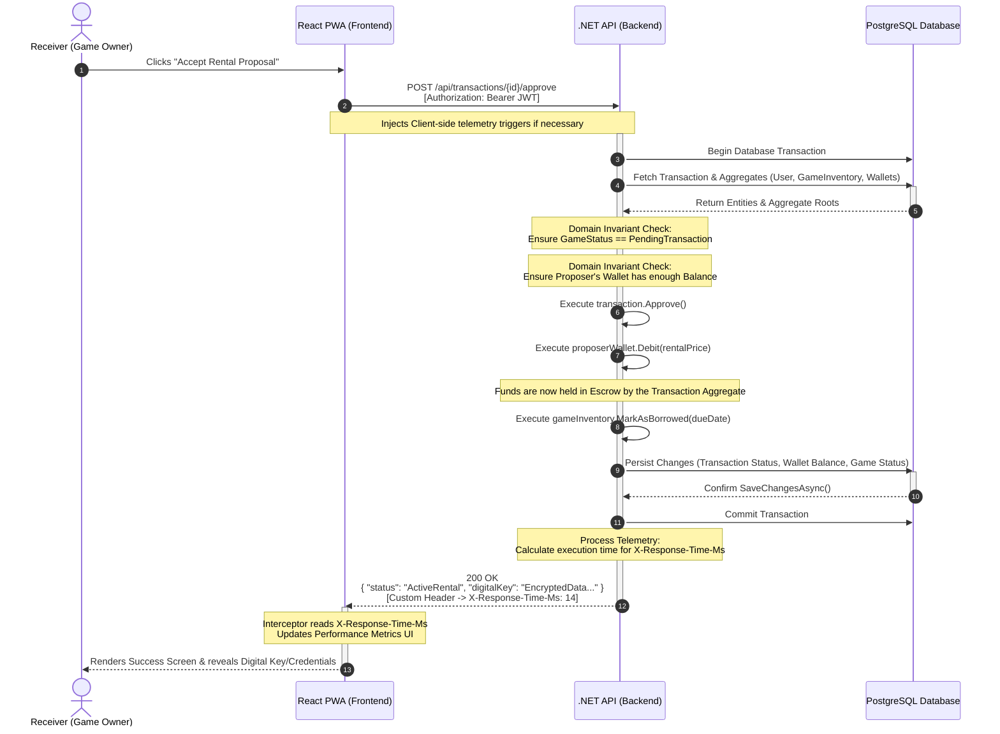
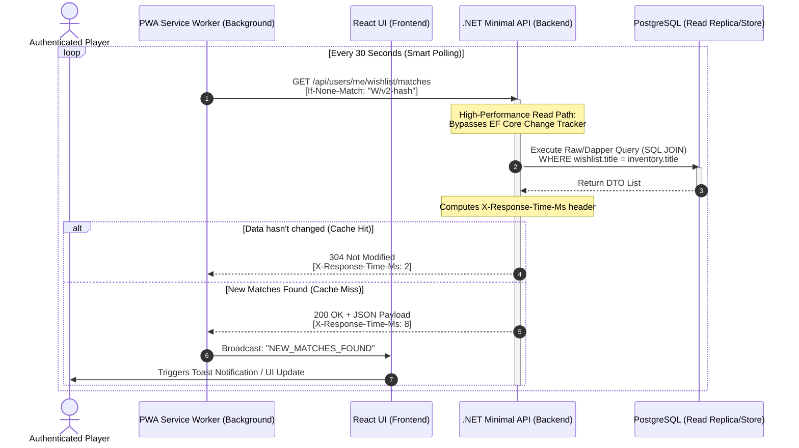

# Transaction Acceptance Sequence Diagram (Paid Rental Flow)

This sequence diagram illustrates the HTTP communication, database transactions, and custom telemetry processing when a user accepts a paid rental proposal. It highlights how the React PWA handles responses and how the .NET API enforces Domain invariants and ACID compliance.

# Wishlist Matchmaking and Telemetry Sequence Diagram (Query/Read Flow)

This diagram illustrates the high-performance read path within **GamesTradeIn**. It highlights how the React PWA background workers interact with .NET Minimal APIs using Dapper for ultra-fast SQL queries, and how client-server telemetry headers are captured to monitor latency.

