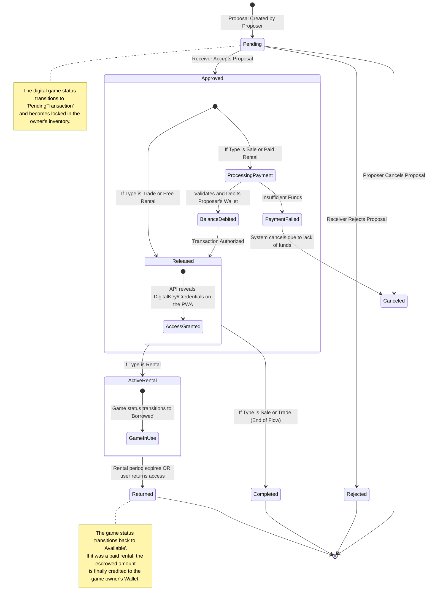

# Transaction State Machine (Sale, Trade, and Rental)

This state machine diagram illustrates the dynamic lifecycle of a transaction within **GamesTradeIn**. It maps how transaction statuses change based on user actions and system triggers, highlighting financial and inventory operations.

